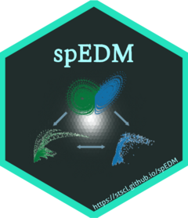

<!-- README.md is generated from README.Rmd. Please edit that file -->

# spEDM 

<!-- badges: start -->

[](https://CRAN.R-project.org/package=spEDM)
[](https://CRAN.R-project.org/package=spEDM)
[](https://cran.r-project.org/web/checks/check_results_spEDM.html)
[](https://CRAN.R-project.org/package=spEDM)
[](https://CRAN.R-project.org/package=spEDM)
[](http://www.gnu.org/licenses/gpl-3.0.html)
[](https://github.com/stscl/spEDM/actions/workflows/R-CMD-check.yaml)
[](https://lifecycle.r-lib.org/articles/stages.html#stable)
[](https://stscl.r-universe.dev/spEDM)

<!-- badges: end -->

***Sp**atial **E**mpirical **D**ynamic **M**odeling*

## Installation

- Install from [CRAN](https://CRAN.R-project.org/package=spEDM) with:

``` r
install.packages("spEDM", dep = TRUE)
```

- Install binary version from
  [R-universe](https://stscl.r-universe.dev/spEDM) with:

``` r
install.packages("spEDM",
                 repos = c("https://stscl.r-universe.dev",
                           "https://cloud.r-project.org"),
                 dep = TRUE)
```

- Install from source code on [GitHub](https://github.com/stscl/spEDM)
  with:

``` r
if (!requireNamespace("devtools")) {
    install.packages("devtools")
}
devtools::install_github("stscl/spEDM",
                         build_vignettes = TRUE,
                         dep = TRUE)
```
