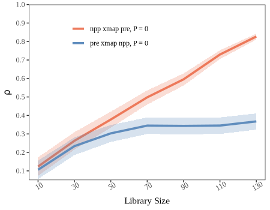

## Methodological Background

Let $Y = \{y_i\}$ and $X = \{x_i\}$ be the two spatial cross sectional variable, where $i = 1, 2, \dots, n$ denotes spatial units (e.g., regions or grid cells), the shadow manifolds of $X$ can be constructed using the different spatial lag values of all spatial units:

$$
M_{x} = \begin{bmatrix}
S_{(\tau)}(x_1) & S_{(2\tau)}(x_1) & \cdots & S_{(E\tau)}(x_1) \\
S_{(\tau)}(x_2) & S_{(2\tau)}(x_2) & \cdots & S_{(E\tau)}(x_2) \\
\vdots & \vdots & \ddots & \vdots \\
S_{(\tau)}(x_n) & S_{(2\tau)}(x_n) & \cdots & S_{(E\tau)}(x_n)
\end{bmatrix}
$$

Here, $S_{(j)}(x_i)$ denotes the $j$ th-order spatial lag value of spatial unit $i$, $\tau$ is the step size for the spatial lag order, and $E$ is the embedding dimension and $M_{x}$ corresponds to the shadow manifolds of $X$.

With the reconstructed shadow manifolds $M_{x}$, the state of Y can be predicted with the state of X through

$$
\hat{Y}_s \mid M_x = \sum\limits_{i=1}^k \left(\omega_{si}Y_{si} \mid M_x \right)
$$

where $s$ represents a spatial unit at which the value of $Y$ needs to be predicted, $\hat{Y}_s$ is the prediction result, $k$ is the number of nearest neighbors used for prediction, $si$ is the spatial unit used in the prediction, $Y_{si}$ is the observation value of $Y$ at $si$. $\omega_{si}$ is the corresponding weight defined as:

$$
\omega_{si} \mid M_x = \frac{weight \left(\psi\left(M_x,s_i\right),\psi\left(M_x,s\right)\right)}{\sum_{i=1}^{L+1}weight \left(\psi\left(M_x,s_i\right),\psi\left(M_x,s\right)\right)}
$$

where $\psi(M_x, s_i)$ is the state vector of spatial unit $s_i$ in the shadow manifold $ M_x$, and $weight (\ast, \ast)$ is the weight function between two states in the shadow manifold, defined as:

$$
weight \left(\psi\left(M_x,s_i\right),\psi\left(M_x,s\right)\right) =
\exp \left(- \frac{dis \left(\psi\left(M_x,s_i\right),\psi\left(M_x,s\right)\right)}{dis \left(\psi\left(M_x,s_1\right),\psi\left(M_x,s\right)\right)} \right)
$$

where $\exp$ is the exponential function and $dis \left(\ast,\ast\right)$ represents the distance function between two states in the shadow manifold defined as:

$$
dis \left( \psi(M_x, s_i), \psi(M_x, s) \right) = \frac{1}{E} \sum_{m=1}^{E} \left| \psi_m(M_x, s_i) - \psi_m(M_x, s) \right|
$$

where $dis \left( \psi(M_x, s_i), \psi(M_x, s) \right)$ denotes the average absolute difference between corresponding elements of the two state vectors in the shadow manifold $M_x$, $E$ is the embedding dimension, and $\psi_m(M_x, s_i)$ is the $m$-th element of the state vector $\psi(M_x, s_i)$.

The skill of cross-mapping prediction $\rho$ is measured by the Pearson correlation coefficient between the true observations and corresponding predictions, and the confidence interval of $\rho$ can be estimated based the $z$-statistics with the normal distribution:

$$
\rho = \frac{Cov\left(Y,\hat{Y}\mid M_x\right)}{\sqrt{Var\left(Y\right) Var\left(\hat{Y}\mid M_x\right)}}
$$

$$
t = \rho \sqrt{\frac{n-2}{1-\rho^2}}
$$

where $n$ is the number of observations to be predicted, and

$$
z = \frac{1}{2} \ln \left(\frac{1+\rho}{1-\rho}\right)
$$

The prediction skill $\rho$ varies by setting different sizes of libraries, which means the quantity of observations used in reconstruction of the shadow manifold. We can use the convergence of $\rho$ to infer the causal associations. For GCCM, the convergence means that $\rho$ increases with the size of libraries and is statistically significant when the library becomes largest.

$$
\rho_{x \to y} = \lim_{L \to \infty} cor \left( Y,\hat{Y}\mid M_x \right)
$$

where $\rho_{x \to y}$ is the correlation after convergence, used to measure the causation effect from $Y$ to $X$, despite the notation suggesting the reverse direction.

## Usage examples

### An example of spatial lattice data

Load the `spEDM` package and its county-level population density data:


``` r
library(spEDM)

popd_nb = spdep::read.gal(system.file("case/popd_nb.gal",package = "spEDM"))
## Warning in spdep::read.gal(system.file("case/popd_nb.gal", package = "spEDM")):
## neighbour object has 4 sub-graphs
popd = readr::read_csv(system.file("case/popd.csv",package = "spEDM"))
## Rows: 2806 Columns: 7
## ── Column specification ────────────────────────────────────────────────────────
## Delimiter: ","
## dbl (7): lon, lat, popd, elev, tem, pre, slope
## 
## ℹ Use `spec()` to retrieve the full column specification for this data.
## ℹ Specify the column types or set `show_col_types = FALSE` to quiet this message.
popd_sf = sf::st_as_sf(popd, coords = c("lon","lat"), crs = 4326)
popd_sf
## Simple feature collection with 2806 features and 5 fields
## Geometry type: POINT
## Dimension:     XY
## Bounding box:  xmin: 74.9055 ymin: 18.2698 xmax: 134.269 ymax: 52.9346
## Geodetic CRS:  WGS 84
## # A tibble: 2,806 × 6
##     popd  elev   tem   pre slope          geometry
##  * <dbl> <dbl> <dbl> <dbl> <dbl>       <POINT [°]>
##  1  780.     8  17.4 1528. 0.452 (116.912 30.4879)
##  2  395.    48  17.2 1487. 0.842 (116.755 30.5877)
##  3  261.    49  16.0 1456. 3.56  (116.541 30.7548)
##  4  258.    23  17.4 1555. 0.932  (116.241 30.104)
##  5  211.   101  16.3 1494. 3.34   (116.173 30.495)
##  6  386.    10  16.6 1382. 1.65  (116.935 30.9839)
##  7  350.    23  17.5 1569. 0.346 (116.677 30.2412)
##  8  470.    22  17.1 1493. 1.88  (117.066 30.6514)
##  9 1226.    11  17.4 1526. 0.208 (117.171 30.5558)
## 10  137.   598  13.9 1458. 5.92  (116.208 30.8983)
## # ℹ 2,796 more rows
```

Determining optimal embedding dimension:


``` r
simplex(popd_sf, "pre", "pre", E = 2:10, k = 6)
## The suggested E and k for variable pre is 3 and 6
simplex(popd_sf, "popd", "popd", E = 2:10, k = 6)
## The suggested E and k for variable popd is 9 and 6
```

Run GCCM:


``` r
startTime = Sys.time()
pd_res = gccm(data = popd_sf,
              cause = "pre",
              effect = "popd",
              libsizes = seq(100, 2800, by = 200),
              E = c(3,9),
              k = 6,
              nb = popd_nb,
              progressbar = FALSE)
endTime = Sys.time()
print(difftime(endTime,startTime, units ="mins"))
## Time difference of 1.863025 mins
pd_res
##    libsizes pre->popd  popd->pre
## 1       100 0.1140592 0.03269659
## 2       300 0.2324104 0.06451333
## 3       500 0.3000403 0.09424558
## 4       700 0.3576318 0.12213856
## 5       900 0.4023234 0.14794178
## 6      1100 0.4449998 0.17006265
## 7      1300 0.4888766 0.19055016
## 8      1500 0.5289804 0.21034768
## 9      1700 0.5720495 0.22720335
## 10     1900 0.6122726 0.24169609
## 11     2100 0.6506091 0.25473781
## 12     2300 0.6863609 0.26493519
## 13     2500 0.7203389 0.27377272
## 14     2700 0.7519251 0.28118969
```

Visualize the result:


``` r
plot(pd_res, xlimits = c(0, 2800), draw_ci = TRUE) +
  ggplot2::theme(legend.justification = c(0.65,1))
```


### An example of spatial grid data

Load the `spEDM` package and its farmland NPP data:


``` r
library(spEDM)

npp = terra::rast(system.file("case/npp.tif", package = "spEDM"))
# To save the computation time, we will aggregate the data by 3 times
npp = terra::aggregate(npp, fact = 3, na.rm = TRUE)
npp
## class       : SpatRaster 
## size        : 135, 161, 5  (nrow, ncol, nlyr)
## resolution  : 30000, 30000  (x, y)
## extent      : -2625763, 2204237, 1867078, 5917078  (xmin, xmax, ymin, ymax)
## coord. ref. : CGCS2000_Albers 
## source(s)   : memory
## names       :      npp,        pre,      tem,      elev,         hfp 
## min values  :   187.50,   390.3351, -47.8194, -110.1494,  0.04434316 
## max values  : 15381.89, 23734.5330, 262.8576, 5217.6431, 42.68803711

# Inspect NA values
terra::global(npp,"isNA")
##       isNA
## npp  14815
## pre  14766
## tem  14766
## elev 14760
## hfp  14972
terra::ncell(npp)
## [1] 21735
nnamat = terra::as.matrix(npp[[1]], wide = TRUE)
nnaindice = which(!is.na(nnamat), arr.ind = TRUE)
dim(nnaindice)
## [1] 6920    2

# Select 1500 non-NA pixels to predict:
set.seed(2025)
indices = sample(nrow(nnaindice), size = 1500, replace = FALSE)
libindice = nnaindice[-indices,]
predindice = nnaindice[indices,]
```

Determining optimal embedding dimension:


``` r
simplex(npp, "pre", "pre", E = 2:10, k = 8, lib = nnaindice, pred = predindice)
## The suggested E and k for variable pre is 2 and 8
simplex(npp, "npp", "npp", E = 2:10, k = 8, lib = nnaindice, pred = predindice)
## The suggested E and k for variable npp is 10 and 8
```

Run GCCM:


``` r
startTime = Sys.time()
npp_res = gccm(data = npp,
               cause = "pre",
               effect = "npp",
               libsizes = matrix(rep(seq(10,130,20),2),ncol = 2),
               E = c(2,10),
               k = 8,
               lib = nnaindice,
               pred = predindice,
               progressbar = FALSE)
endTime = Sys.time()
print(difftime(endTime,startTime, units ="mins"))
## Time difference of 0.9523582 mins
npp_res
##   libsizes  pre->npp  npp->pre
## 1       10 0.1282926 0.1111690
## 2       30 0.2600225 0.2346917
## 3       50 0.3773586 0.2998472
## 4       70 0.4968706 0.3411285
## 5       90 0.5975915 0.3393013
## 6      110 0.7362461 0.3434810
## 7      130 0.8385761 0.3633303
```

Visualize the result:


``` r
plot(npp_res,xlimits = c(5, 135),ylimits = c(0.05,1), draw_ci = TRUE) +
  ggplot2::theme(legend.justification = c(0.25,1))
```


