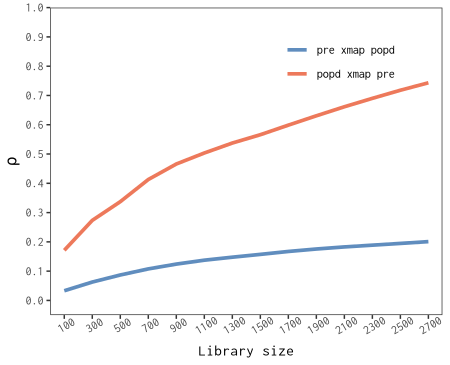
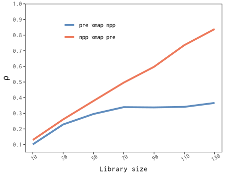

## 1.1 Install the `spEDM` package

Install the stable version from [CRAN](https://CRAN.R-project.org/package=spEDM) with:

```r
install.packages("spEDM", dep = TRUE)
```

Alternatively, you can install the development version from [R-universe](https://stscl.r-universe.dev/spEDM) with:

``` r
install.packages("spEDM",
                 repos = c("https://stscl.r-universe.dev",
                           "https://cloud.r-project.org"),
                 dep = TRUE)
```

## 1.2 An example of spatial lattice data

Load the `spEDM` package:


``` r
library(spEDM)
```

Load the county-level population density data from the `spEDM` package:


``` r
popd_nb = spdep::read.gal(system.file("extdata/popdensity_nb.gal",
                                      package = "spEDM"))
## Warning in spdep::read.gal(system.file("extdata/popdensity_nb.gal", package =
## "spEDM")): neighbour object has 4 sub-graphs
popd_nb
## Neighbour list object:
## Number of regions: 2806 
## Number of nonzero links: 15942 
## Percentage nonzero weights: 0.2024732 
## Average number of links: 5.681397 
## 4 disjoint connected subgraphs

popdensity = readr::read_csv(system.file("extdata/popdensity.csv",
                                         package = "spEDM"))
## Rows: 2806 Columns: 7
## ── Column specification ────────────────────────────────────────────────────────────────────────────
## Delimiter: ","
## dbl (7): x, y, popDensity, DEM, Tem, Pre, slop
## 
## ℹ Use `spec()` to retrieve the full column specification for this data.
## ℹ Specify the column types or set `show_col_types = FALSE` to quiet this message.
popdensity
## # A tibble: 2,806 × 7
##        x     y popDensity   DEM   Tem   Pre  slop
##    <dbl> <dbl>      <dbl> <dbl> <dbl> <dbl> <dbl>
##  1  117.  30.5       780.     8  17.4 1528. 0.452
##  2  117.  30.6       395.    48  17.2 1487. 0.842
##  3  117.  30.8       261.    49  16.0 1456. 3.56 
##  4  116.  30.1       258.    23  17.4 1555. 0.932
##  5  116.  30.5       211.   101  16.3 1494. 3.34 
##  6  117.  31.0       386.    10  16.6 1382. 1.65 
##  7  117.  30.2       350.    23  17.5 1569. 0.346
##  8  117.  30.7       470.    22  17.1 1493. 1.88 
##  9  117.  30.6      1226.    11  17.4 1526. 0.208
## 10  116.  30.9       137.   598  13.9 1458. 5.92 
## # ℹ 2,796 more rows

popd_sf = sf::st_as_sf(popdensity, coords = c("x","y"), crs = 4326)
popd_sf
## Simple feature collection with 2806 features and 5 fields
## Geometry type: POINT
## Dimension:     XY
## Bounding box:  xmin: 74.9055 ymin: 18.2698 xmax: 134.269 ymax: 52.9346
## Geodetic CRS:  WGS 84
## # A tibble: 2,806 × 6
##    popDensity   DEM   Tem   Pre  slop          geometry
##  *      <dbl> <dbl> <dbl> <dbl> <dbl>       <POINT [°]>
##  1       780.     8  17.4 1528. 0.452 (116.912 30.4879)
##  2       395.    48  17.2 1487. 0.842 (116.755 30.5877)
##  3       261.    49  16.0 1456. 3.56  (116.541 30.7548)
##  4       258.    23  17.4 1555. 0.932  (116.241 30.104)
##  5       211.   101  16.3 1494. 3.34   (116.173 30.495)
##  6       386.    10  16.6 1382. 1.65  (116.935 30.9839)
##  7       350.    23  17.5 1569. 0.346 (116.677 30.2412)
##  8       470.    22  17.1 1493. 1.88  (117.066 30.6514)
##  9      1226.    11  17.4 1526. 0.208 (117.171 30.5558)
## 10       137.   598  13.9 1458. 5.92  (116.208 30.8983)
## # ℹ 2,796 more rows
```

Select the appropriate embedding dimension E:


``` r
simplex(popd_sf,"Pre",lib = 1:2000,pred = 2001:nrow(popd_sf),k = 6,nb = popd_nb,trend.rm = TRUE)
## The suggested E and k for variable Pre is 2 and 6
```


``` r
simplex(popd_sf,"popDensity",lib = 1:2000,pred = 2001:nrow(popd_sf),k = 6,nb = popd_nb,trend.rm = TRUE)
## The suggested E and k for variable popDensity is 5 and 6
```

We choose the E with the highest rho and the lowest MAE and RMSE as the most suitable one. Under the selected lib and pred, the optimal embedding dimension E for the variable `Pre` is 2, and for the variable `popDensity`, it is 5.

Then, run GCCM:


``` r
startTime = Sys.time()
pd_res = gccm(data = popd_sf,
              cause = "Pre",
              effect = "popDensity",
              libsizes = seq(10, 2800, by = 100),
              E = c(2,5),
              k = 6,
              nb = popd_nb,
              progressbar = FALSE)
endTime = Sys.time()
print(difftime(endTime,startTime, units ="mins"))
## Time difference of 5.802845 mins
pd_res
##    libsizes Pre->popDensity popDensity->Pre
## 1        10      0.05589905      0.01004636
## 2       110      0.18109636      0.03478543
## 3       210      0.24325566      0.04932428
## 4       310      0.27657692      0.06417637
## 5       410      0.30630281      0.07634983
## 6       510      0.34116169      0.08815848
## 7       610      0.38078810      0.09890353
## 8       710      0.41612716      0.10867846
## 9       810      0.44420437      0.11714337
## 10      910      0.46815429      0.12485229
## 11     1010      0.48876449      0.13194552
## 12     1110      0.50538462      0.13802611
## 13     1210      0.52300459      0.14335037
## 14     1310      0.53902632      0.14813342
## 15     1410      0.55309048      0.15284706
## 16     1510      0.56754023      0.15777314
## 17     1610      0.58387624      0.16301596
## 18     1710      0.60029184      0.16768202
## 19     1810      0.61631190      0.17202960
## 20     1910      0.63213899      0.17601166
## 21     2010      0.64785899      0.17979878
## 22     2110      0.66289302      0.18304365
## 23     2210      0.67740971      0.18596497
## 24     2310      0.69156193      0.18906187
## 25     2410      0.70541793      0.19196548
## 26     2510      0.71925253      0.19503355
## 27     2610      0.73287448      0.19819076
## 28     2710      0.74435871      0.20116518
```

Visualize the result:


``` r
plot(pd_res,xlimits = c(0, 2800)) +
  ggplot2::theme(legend.justification = c(0.85,1))
```



## 1.3 An example of spatial grid data

Load the `spEDM` package:

```r
library(spEDM)
```

Load the farmland NPP data from the `spEDM` package:


``` r
npp = terra::rast(system.file("extdata/npp.tif", package = "spEDM"))
npp
## class       : SpatRaster 
## dimensions  : 404, 483, 3  (nrow, ncol, nlyr)
## resolution  : 10000, 10000  (x, y)
## extent      : -2625763, 2204237, 1877078, 5917078  (xmin, xmax, ymin, ymax)
## coord. ref. : CGCS2000_Albers 
## source      : npp.tif 
## names       :      npp,        pre,      tem 
## min values  :   164.00,   384.3409, -47.8194 
## max values  : 16606.33, 23878.3555, 263.6938

# configure the default colormap in terra
options(terra.pal = grDevices::terrain.colors(100,rev = T))
# visualize raster data
terra::plot(npp, nc = 3,
            mar = rep(0.1,4),
            oma = rep(0.1,4),
            axes = FALSE,
            legend = FALSE)
```



*To save the computation time, we will aggregate the data by 3 times and select 1500 non-NA pixels to predict:*


``` r
npp = terra::aggregate(npp, fact = 3, na.rm = TRUE)
terra::global(npp,"isNA")
##      isNA
## npp 14815
## pre 14766
## tem 14766
terra::ncell(npp)
## [1] 21735

nnamat = terra::as.matrix(npp[[1]], wide = TRUE)
nnaindice = which(!is.na(nnamat), arr.ind = TRUE)
dim(nnaindice)
## [1] 6920    2

set.seed(2025)
indices = sample(nrow(nnaindice), size = 1500, replace = FALSE)
libindice = nnaindice[-indices,]
predindice = nnaindice[indices,]
```

Due to the high number of NA values in the npp raster data, we used all non-NA cell as the libraries when testing for the most suitable embedding dimensions.


``` r
simplex(npp,"pre",nnaindice,predindice,k = 8,trend.rm = TRUE)
## The suggested E and k for variable pre is 2 and 8
```


``` r
simplex(npp,"npp",nnaindice,predindice,k = 8,trend.rm = TRUE)
## The suggested E and k for variable npp is 10 and 8
```

Under the selected lib and pred, the optimal embedding dimension E for the variable `pre` is 2, and for the variable `npp`, it is 10.

Then, run GCCM:


``` r
startTime = Sys.time()
npp_res = gccm(data = npp,
               cause = "pre",
               effect = "npp",
               libsizes = as.matrix(expand.grid(seq(10,130,10),seq(10,160,10))),
               E = c(2,10),
               k = 8,
               lib = nnaindice,
               pred = predindice,
               progressbar = FALSE)
endTime = Sys.time()
print(difftime(endTime,startTime, units ="mins"))
## Time difference of 9.429752 mins
npp_res
##    libsizes  pre->npp  npp->pre
## 1        10 0.1295281 0.1013898
## 2        20 0.1990710 0.1605447
## 3        30 0.2607783 0.2286559
## 4        40 0.3219650 0.2744616
## 5        50 0.3788341 0.2956426
## 6        60 0.4512668 0.3272331
## 7        70 0.4961658 0.3394660
## 8        80 0.5366037 0.3378108
## 9        90 0.5972341 0.3376894
## 10      100 0.6670024 0.3405838
## 11      110 0.7358447 0.3412305
## 12      120 0.7981711 0.3500295
## 13      130 0.8386849 0.3663077
## 14      140 0.8460446 0.3687385
## 15      150 0.8483344 0.3696080
## 16      160 0.8503816 0.3695784
```

Visualize the result:


``` r
plot(npp_res,xlimits = c(9, 161),ylimits = c(0.05,1)) +
  ggplot2::theme(legend.justification = c(0.25,1))
```


