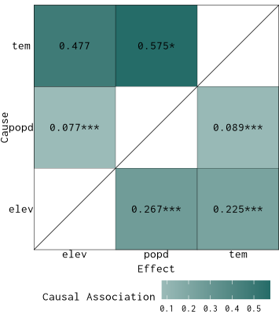
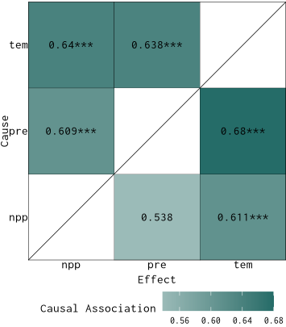

## Methodological Background

To measure causal strengths from spatial cross-sectional data, GCMC (Geographical Cross Mapping Cardinality) employs a three-stage procedure:

**Stage one** involves reconstructing the state space. Given two spatial variables, $x$ and $y$, this step requires determining a suitable embedding dimension $E$ and a spatial lag interval $\tau$. For each spatial location (unit) $i$, the attribute values from its spatial neighbors at lag orders $\tau, 2\tau, \dots, E\tau$ are collected. These values are then summarized—commonly using the mean—to construct an embedding vector for each unit. Aggregating these vectors across all spatial units results in the reconstructed state spaces, denoted as $E_x$ and $E_y$.

**Stage two** constructs the Intersectional Cardinality (IC) curve, which serves to evaluate causal strength. To measure whether $y$ causally affects $x$, one computes, for each $k$, the overlap between the $k$ nearest neighbors of $E_y$ and the corresponding "projected" neighbors traced through $E_x$. Specifically, for each point in $E_x$, its $k$ nearest neighbors are identified, and their mapped neighbors in $E_y$ are compared with the direct neighbors of $E_y$. The IC curve is formed by recording the number of shared neighbors across a range of $k = 1, 2, \dots, n$. This process can also be reversed to test for causality from $x$ to $y$.

**Stage three** involves quantifying and validating the causal strengths. The area under the IC curve (AUC) provides a numerical measure of causal strength. To determine whether the observed causal strength is statistically significant, a hypothesis test is performed: the null assumes no causality, while the alternative assumes its presence. The DeLong palcements method is applied to evaluate the difference in AUCs under these hypotheses. It also yields confidence intervals, supporting robust causal inference.

## Usage examples

### An example of spatial lattice data

Load the `spEDM` package and its county-level population density data:


``` r
library(spEDM)

popd_nb = spdep::read.gal(system.file("case/popd_nb.gal",package = "spEDM"))
## Warning in spdep::read.gal(system.file("case/popd_nb.gal", package = "spEDM")):
## neighbour object has 4 sub-graphs
popd = readr::read_csv(system.file("case/popd.csv",package = "spEDM"))
## Rows: 2806 Columns: 7
## ── Column specification ────────────────────────────────────────────────────────
## Delimiter: ","
## dbl (7): lon, lat, popd, elev, tem, pre, slope
## 
## ℹ Use `spec()` to retrieve the full column specification for this data.
## ℹ Specify the column types or set `show_col_types = FALSE` to quiet this message.
popd_sf = sf::st_as_sf(popd, coords = c("lon","lat"), crs = 4326)
popd_sf
## Simple feature collection with 2806 features and 5 fields
## Geometry type: POINT
## Dimension:     XY
## Bounding box:  xmin: 74.9055 ymin: 18.2698 xmax: 134.269 ymax: 52.9346
## Geodetic CRS:  WGS 84
## # A tibble: 2,806 × 6
##     popd  elev   tem   pre slope          geometry
##  * <dbl> <dbl> <dbl> <dbl> <dbl>       <POINT [°]>
##  1  780.     8  17.4 1528. 0.452 (116.912 30.4879)
##  2  395.    48  17.2 1487. 0.842 (116.755 30.5877)
##  3  261.    49  16.0 1456. 3.56  (116.541 30.7548)
##  4  258.    23  17.4 1555. 0.932  (116.241 30.104)
##  5  211.   101  16.3 1494. 3.34   (116.173 30.495)
##  6  386.    10  16.6 1382. 1.65  (116.935 30.9839)
##  7  350.    23  17.5 1569. 0.346 (116.677 30.2412)
##  8  470.    22  17.1 1493. 1.88  (117.066 30.6514)
##  9 1226.    11  17.4 1526. 0.208 (117.171 30.5558)
## 10  137.   598  13.9 1458. 5.92  (116.208 30.8983)
## # ℹ 2,796 more rows
```

The false nearest neighbours (FNN) method helps identify the appropriate embedding dimension for reconstructing the state space of a time series or spatial cross-sectional data. A low embedding dimension that minimizes false neighbours is considered optimal.


``` r
fnn(popd_sf, "popd", E = 1:15, eps = stats::sd(popd_sf$popd) / 10)
##       E:1       E:2       E:3       E:4       E:5       E:6       E:7       E:8 
## 0.9707769 0.6404134 0.4885959 0.4012830 0.3346401 0.3296507 0.3260870 0.3150392 
##       E:9      E:10      E:11      E:12      E:13      E:14 
## 0.3150392 0.2957947 0.2875980 0.2915182 0.2701354 0.2494654
```

The false nearest neighbours (FNN) ratio decreased to approximately 0.3 when the embedding dimension E reached 10, and remained relatively stable thereafter. Therefore, we adopted $E = 10$ as the embedding dimension for subsequent GCMC analysis.

Then, run GCMC:


``` r
# temperature and population density
g1 = gcmc(popd_sf, "tem", "popd", E = 10, k = 200, nb = popd_nb, progressbar = FALSE)
g1
##   neighbors tem->popd popd->tem
## 1       200    0.5754   0.08985

# elevation and population density
g2 = gcmc(popd_sf, "elev", "popd", E = 10, k = 200, nb = popd_nb, progressbar = FALSE)
g2
##   neighbors elev->popd popd->elev
## 1       200     0.2675   0.077025

# elevation and temperature
g3 = gcmc(popd_sf, "elev", "tem", E = 10, k = 200, nb = popd_nb, progressbar = FALSE)
g3
##   neighbors elev->tem tem->elev
## 1       200  0.224925    0.4775
```

Here we define two functions to process the results and plot the causal strengths matrix.


``` r
.process_xmap_result = \(g){
  tempdf = g$xmap
  tempdf$x = g$varname[1]
  tempdf$y = g$varname[2]
  tempdf = dplyr::select(tempdf, 1, x, y,
                         x_xmap_y_mean,x_xmap_y_sig,
                         y_xmap_x_mean,y_xmap_x_sig,
                         dplyr::everything())

  g1 = tempdf |>
    dplyr::select(x,y,y_xmap_x_mean,y_xmap_x_sig)|>
    purrr::set_names(c("cause","effect","cs","sig"))
  g2 = tempdf |>
    dplyr::select(y,x,x_xmap_y_mean,x_xmap_y_sig) |>
    purrr::set_names(c("cause","effect","cs","sig"))

  return(rbind(g1,g2))
}

plot_cs_matrix = \(.tbf,legend_title = "Causal Strength"){
  .tbf = .tbf |>
    dplyr::mutate(sig_marker = dplyr::case_when(
        sig > 0.05 ~ sprintf("paste(%.4f^'#')", cs),
              TRUE ~ sprintf('%.4f', cs)
    ))

  fig = ggplot2::ggplot(data = .tbf,
                        ggplot2::aes(x = effect, y = cause)) +
    ggplot2::geom_tile(color = "black", ggplot2::aes(fill = cs)) +
    ggplot2::geom_abline(slope = 1, intercept = 0,
                         color = "black", linewidth = 0.25) +
    ggplot2::geom_text(ggplot2::aes(label = sig_marker), parse = TRUE,
                       color = "black", family = "serif") +
    ggplot2::labs(x = "Effect", y = "Cause", fill = legend_title) +
    ggplot2::scale_x_discrete(expand = c(0, 0)) +
    ggplot2::scale_y_discrete(expand = c(0, 0)) +
    ggplot2::scale_fill_gradient(low = "#9bbbb8", high = "#256c68") +
    ggplot2::coord_equal() +
    ggplot2::theme_void() +
    ggplot2::theme(
      axis.text.x = ggplot2::element_text(angle = 0, family = "serif"),
      axis.text.y = ggplot2::element_text(color = "black", family = "serif"),
      axis.title.y = ggplot2::element_text(angle = 90, family = "serif"),
      axis.title.x = ggplot2::element_text(color = "black", family = "serif",
                                           margin = ggplot2::margin(t = 5.5, unit = "pt")),
      legend.text = ggplot2::element_text(family = "serif"),
      legend.title = ggplot2::element_text(family = "serif"),
      legend.background = ggplot2::element_rect(fill = NA, color = NA),
      legend.direction = "horizontal",
      legend.position = "bottom",
      legend.margin = ggplot2::margin(t = 1, r = 0, b = 0, l = 0, unit = "pt"),
      legend.key.width = ggplot2::unit(20, "pt"),
      panel.grid = ggplot2::element_blank(),
      panel.border = ggplot2::element_rect(color = "black", fill = NA)
    )
  return(fig)
}
```

Organize the results into a long table:


``` r
res1 = list(g1,g2,g3) |>
  purrr::map(.process_xmap_result) |>
  purrr::list_rbind()
res1
##   cause effect       cs           sig
## 1   tem   popd 0.575400  1.861243e-02
## 2  popd    tem 0.089850 5.082649e-115
## 3  elev   popd 0.267500  9.449794e-16
## 4  popd   elev 0.077025 2.308728e-147
## 5  elev    tem 0.224925  1.985034e-23
## 6   tem   elev 0.477500  4.965603e-01
```

Visualize the result:


``` r
plot_cs_matrix(res1)
```



### An example of spatial grid data

Load the `spEDM` package and its farmland NPP data:


``` r
library(spEDM)

npp = terra::rast(system.file("case/npp.tif", package = "spEDM"))
# To save the computation time, we will aggregate the data by 3 times
npp = terra::aggregate(npp, fact = 3, na.rm = TRUE)
npp
## class       : SpatRaster 
## size        : 135, 161, 5  (nrow, ncol, nlyr)
## resolution  : 30000, 30000  (x, y)
## extent      : -2625763, 2204237, 1867078, 5917078  (xmin, xmax, ymin, ymax)
## coord. ref. : CGCS2000_Albers 
## source(s)   : memory
## names       :      npp,        pre,      tem,      elev,         hfp 
## min values  :   187.50,   390.3351, -47.8194, -110.1494,  0.04434316 
## max values  : 15381.89, 23734.5330, 262.8576, 5217.6431, 42.68803711

# Inspect NA values
terra::global(npp,"isNA")
##       isNA
## npp  14815
## pre  14766
## tem  14766
## elev 14760
## hfp  14972
terra::ncell(npp)
## [1] 21735
nnamat = terra::as.matrix(npp[[1]], wide = TRUE)
nnaindice = which(!is.na(nnamat), arr.ind = TRUE)
dim(nnaindice)
## [1] 6920    2

# Select 1500 non-NA pixels to predict:
set.seed(2025)
indices = sample(nrow(nnaindice), size = 1500, replace = FALSE)
libindice = nnaindice[-indices,]
predindice = nnaindice[indices,]
```

Determining optimal embedding dimension:


``` r
fnn(npp, "npp", E = 1:25, lib = predindice, pred = predindice,
    eps = stats::sd(terra::values(npp[["npp"]]),na.rm = TRUE) / 10)
##        E:1        E:2        E:3        E:4        E:5        E:6        E:7 
## 0.94062708 0.43266667 0.29533333 0.28200000 0.24133333 0.23066667 0.23066667 
##        E:8        E:9       E:10       E:11       E:12       E:13       E:14 
## 0.19733333 0.19533333 0.15333333 0.15933333 0.16333333 0.14600000 0.13000000 
##       E:15       E:16       E:17       E:18       E:19       E:20       E:21 
## 0.13400000 0.10733333 0.11466667 0.10933333 0.09000000 0.09933333 0.08600000 
##       E:22       E:23       E:24 
## 0.09866667 0.10466667 0.10866667
```

At $E = 18$, the false nearest neighbor ratio stabilizes at 0.10 and remains constant thereafter. Therefore, $E = 18$ is selected for the subsequent GCMC analysis.


``` r
# precipitation and npp
g1 = gcmc(npp, "pre", "npp", E = 18, k = 165, lib = predindice, pred = predindice, progressbar = FALSE)
g1
##   neighbors  pre->npp  npp->pre
## 1       165 0.2397429 0.2060239

# temperature and npp
g2 = gcmc(npp, "tem", "npp", E = 18, k = 165, lib = predindice, pred = predindice, progressbar = FALSE)
g2
##   neighbors  tem->npp npp->tem
## 1       165 0.4287971 0.432213

# precipitation and temperature
g3 = gcmc(npp, "pre", "tem", E = 18, k = 165, lib = predindice, pred = predindice, progressbar = FALSE)
g3
##   neighbors  pre->tem  tem->pre
## 1       165 0.3222039 0.2725069
```

Organize the results into a long table:


``` r
res2 = list(g1,g2,g3) |>
  purrr::map(.process_xmap_result) |>
  purrr::list_rbind()
res2
##   cause effect        cs          sig
## 1   pre    npp 0.2397429 1.571807e-17
## 2   npp    pre 0.2060239 6.525044e-25
## 3   tem    npp 0.4287971 4.706879e-02
## 4   npp    tem 0.4322130 5.956946e-02
## 5   pre    tem 0.3222039 1.261609e-07
## 6   tem    pre 0.2725069 5.041517e-13
```

Visualize the result:


``` r
plot_cs_matrix(res2)
```


